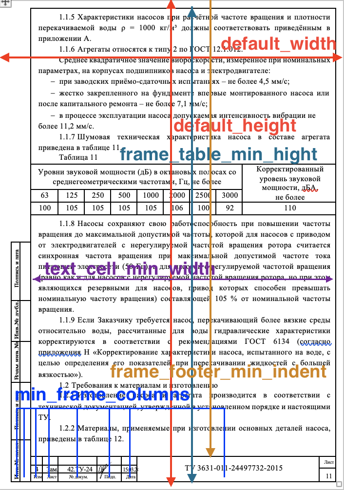

# Запуск

1. Скачать репозиторий и перейти в корневой католог репо:
   ```bash
   git clone https://github.com/ra-led/docx-html-render.git
   cd docx-html-render
   ```

2. Собрать Docker образ:
   ```bash
   docker build -t doc-parse:latest ./src
   ```
   **Примечание**: во время сборки модели классификаторов [загружаются](https://github.com/ra-led/docx-html-render/blob/main/src/Dockerfile#L14-L18) из Google Drive и сохраняются в образе контейнера.

3. Запустить полный стэк сервисов:
   ```bash
   docker-compose up -d
   ```
   
    Веб приложение будет доступно по адресу `http://localhost:5000`.
    API для конвертации в JSON будет доступно по адресу `http://localhost:8000`.

4. Проверить работоспособность

   Конвертация в HTML:
   ```bash
   curl -X POST localhost:5000 -H "Content-Type: multipart/form-data" -F "file=@src/test/docs_examples/doc_1.docx"
   ```

   Конвертация в JSON:
   ```bash
   curl -s -X POST localhost:8000 -H "Content-Type: multipart/form-data" -F "file=@src/test/docs_examples/doc_1.docx" | jq
   ```

# Модуль для парсинга .docx документов doc_parse

Этот модуль предназначен для парсинга документов формата .docx и преобразования их содержимого в HTML и JSON. В данном описании представлен обзор работы модуля, включая основные классы и функции, используемые для обработки документов.

## Структура модуля `doc_parse`

Модуль состоит из следующих файлов:

- `doc_parse/conf.yaml`
- `doc_parse/__init__.py`
- `doc_parse/core.py`
- `doc_parse/ml.py`
- `doc_parse/numbering.py`
- `doc_parse/ooxml.py`
- `doc_parse/export_html.py`
- `doc_parse/export_json.py`

## Параметры бработки в conf.yaml

- `default_width`: Ширина страницы по умолчанию, используемая в случае, если ширина не может быть определена из XML документа.

- `default_height`: Высота страницы по умолчанию, используемая в случае, если высота не может быть определена из XML документа.

- `max_frame_space`: Минимальное количество колонок в таблице которой оформлена чертежная рамка.

- `max_toc_pages`: Максимальное количество страниц, которые могут быть включены в оглавление.

- `max_doc_pages`: Максимальное количество страниц в документе.

- `avg_page_chars_count`:Среднее количество символов на странице, используемое для вычесления номера страницы (XML не содержит его).

- `text_cell_min_width`: Минимальная ширина ячейки, содержащей текст (параграфы не являющиеся таблицей), выраженная в долях от ширины страницы.

- `frame_table_min_hight`: Минимальная высота таблицы с чертежной рамкой, выраженная в долях от высоты страницы.

- `min_frame_columns`: Минимальное количество колонок в таблице которой оформлена чертежная рамка.

- `frame_footer_min_indent`: Минимальный отступ для нижнего колонтитула таблицы с рамкой, выраженный в долях от высоты страницы.



## Описание файлов

### `__init__.py`

Этот модуль предоставляет функции для конвертации документов различных форматов. Он включает в себя три основные функции:

- `doc_to_docx`: Преобразует файл формата .doc в формат .docx с использованием библиотеки Aspose.Words. Может быть использован для обновления старых документов .doc до более современного формата .docx.
- `docx_to_html`: Преобразует документ формата .docx в HTML. Полезно для отображения документов в веб-браузерах (особенно для дебага) или интеграции с веб-приложениями. Также полезно для пост-обработки NLP моделями, т.к. html часто встречается в датасетах используемых для претрейна и вместе с текстом несет в себе визуальную составляющую.
- `docx_to_json`: Преобразует документ формата .docx в форматированный, согласно спецификации, JSON. 

### `core.py`

Содержит основные классы для обработки параграфов и таблиц в документе:

- `Node`: Базовый класс для представления узлов в иерархии документа.
- `ParHandler`: Обрабатывает параграфы, извлекая текст, стили и XML-представление.
- `TableHandler`: Обрабатывает таблицы, извлекая их размеры, содержимое и определяя, являются ли они рамками.
- `CellHandler`: Обрабатывает ячейки таблиц, извлекая их содержимое и размеры.
- `TableView`: Представляет таблицу в виде узла иерархии документа.
- `DocRoot`: Представляет корневой узел документа.

### `ml.py`

Содержит класс для классификации текста с использованием модели BERT:

- `BERTTextClassifier`: Классифицирует текст, используя предобученную модель BERT.

### `numbering.py`

Содержит классы и функции для обработки нумерации и стилей в документе:

- `NumberingDB`: Обрабатывает нумерацию и стили параграфов, используя XML-представление документа.
- `find_manual_numbering`: Определяет ручную нумерацию в тексте.
- `int_to_roman`: Преобразует целое число в римскую цифру.

### `ooxml.py`

Содержит основной класс для обработки документа и преобразования его содержимого в HTML:

- `DocHandler`: Основной класс, который обрабатывает документ, извлекая параграфы и таблицы, и формирует их в иерархию.
- `table_extend`: Определяет, могут ли две таблицы быть объединены.
- `concat_tables`: Объединяет две таблицы.

## Пример использования
Экспорт в HTML

```python
import docx
from doc_parse import DocHandler, DocHTML

doc = docx.Document(path_to_docx_file)
handler = DocHandler(doc)
converter = DocHTML()

html_content, toc_links = converter.get_html(handler)
```

Экспорт в JSON

```python
import docx
from doc_parse import DocHandler, DocJSON

doc = docx.Document(path_to_docx_file)
handler = DocHandler(doc)
converter = DocJSON()

json_content = converter.get_html(handler)
```

Экспорт в HTML и JSON (используется один DocHandler, чтобы избежать повторной обработки документа)

```python
import docx
from doc_parse import DocHandler, DocHTML, DocJSON

doc = docx.Document(path_to_docx_file)
handler = DocHandler(doc)

# Convert to HTML
html_converter = DocHTML()
html_content, toc_links = html_converter.get_html(handler)

json_converter = DocJSON()
json_content = json_converter.get_json(handler)
```

## Ход процесса парсинга

1. **Импортирование документа**: Используется библиотека `docx` для загрузки документа.
2. **Инициализация обработчика**: Создается экземпляр класса `DocHandler`, который принимает документ и настройки.
3. **Обработка документа**: Вызывается метод `process` класса `DocHandler`, который:
   - Итерирует по содержимому документа.
   - Обрабатывает параграфы с помощью `ParHandler`.
   - Обрабатывает таблицы с помощью `TableHandler` и `TableView` (более подробно описано ниже).
4. **Формирование иерархии**: Для каждого параграфа и таблицы создается узел (`Node`) и добавляется в иерархию документа.
5. **Обработка нумерации и стилей**: Используется `NumberingDB.numerize` для обработки нумерации и стилей параграфов (более подробно описано ниже).
6. **Классификация текста**: При необходимости используется `BERTTextClassifier` для классификации текста.
7. **Формирование**: После обработки всего содержимого, документ готов для экспорта в HTML или JSON.

## Расчет нумерации с NumberingDB
### Инициализация класса `NumberingDB`

При создании экземпляра класса `NumberingDB`, выполняются следующие действия:

1. **Инициализация параметров**:
   - `doc`: DOCX документ для обработки.
   - `appendix_header_length`: Максимальная длина заголовка приложения.
   - `default_levels`: Количество уровней нумерации по умолчанию.
   - `default_font`: Размер шрифта по умолчанию.
   - `norm_numeration_model`: Путь к модели для классификации нумерованных заголовков.
   - `norm_heading_model`: Путь к модели для классификации ненумерованных заголовков.

2. **Парсинг XML нумерации**:
   - Извлекает XML-данные нумерации из DOCX документа.
   - Если парсинг не удался, устанавливает `self.num_xml` в пустой словарь.

3. **Инициализация дефолтных абстрактных уровней**:
   - Создает дефолтные уровни нумерации с помощью `self.init_default_abstract`.

4. **Получение и связывание уровней и абстрактных уровней**:
   - Извлекает ID тредов нумерации (`numId`) и абстрактные уровни нумерации из XML-данных.
   - Извлекает ID и метаданные стилей определенных в документе.
   - Связывает треды нумерации с абстрактными уровнями и стили с абстрактными уровнями.

5. **Инициализация инкремента нумерации**:
   - Создает словарь для отслеживания инкремента нумерации.

6. **Инициализация классификаторов**:
   - Загружает модели BERT для классификации потенциальных заголовков.

7. **Определение стоп-символов**:
   - Устанавливает список стоп-символов, которые могут влиять на обработку нумерации.

### Обработка параграфа в функции `NumberingDB.numerize`

Функция `NumberingDB.numerize` обрабатывает параграф, пытаясь определить и нормализовать его нумерацию. В этой функции происходит следующее:

1. **Обновление статистики размера шрифта**:
   - Добавляет размер шрифта параграфа в список `self.font_size`.

2. **Определение приоритета методов обработки**:
   - Устанавливает порядок применения методов для обработки нумерации:
     1. `numrize_by_meta`: Обрабатывает нумерацию по метаданным.
     2. `numrize_by_style`: Обрабатывает нумерацию по стилю.
     3. `numerize_by_text`: Определяет нумерацию в текстовом префиксе.
     4. `numerize_by_heading`: Обрабатывает нумерацию по заголовку.
     5. `numerize_by_appendix`: Определяет нумерацию для приложений.

3. **Применение методов обработки**:
   - Последовательно применяет каждый метод из списка `numerize_prioritet` к параграфу.
   - Если какой-либо метод успешно определил нумерацию (`par.node.num_prefix` не пустой), останавливает дальнейшую обработку.

4. **Возврат обработанного параграфа**:
   - Возвращает параграф с установленной нумерацией (если она была определена).

### Подробности методов обработки

- **`numrize_by_meta`**:
  - Извлекает `numId` и уровень нумерации из XML-данных параграфа.
  - Получает абстрактный ID нумерации.
  - Считает встроенную нумерацию для данного абстрактного ID и уровня.
  - Проверяет, является ли параграф заголовком и корректирует глубину нумерации.
  - Проверяет наличие стоп-символов в префиксе нумерации и начале текста.

- **`numrize_by_style`**:
  - Получает абстрактный ID нумерации по стилю параграфа.
  - Считает встроенную нумерацию для данного абстрактного ID и уровня.

- **`numerize_by_text`**:
  - Определяет нумерацию в текстовом префиксе параграфа.
  - Проверяет наличие стоп-символов в начале текста.
  - Проверяет, является ли параграф заголовком.
  - Проверяет результат классификатора - является ли текст параграфа нумерованным заголовком.

- **`numerize_by_heading`**:
  - Проверяет, является ли параграф заголовком.
  - Проверяет результат классификатора - является ли текст параграфа заголовком.

- **`numerize_by_appendix`**:
  - Определяет, является ли параграф заголовком приложения.

## Обработка таблиц с использованием классов `TableHandler` и `TableView`.

### 1. Инициализация `TableHandler`

При вызове `DocHandler.process_table`, первым шагом инициализируется `TableHandler` с передачей таблицы, ширины и высоты страницы, а также дополнительных параметров конфигурации (`doc_parse.conf.CONF`). В процессе инициализации:

- Извлекаются XML-данные таблицы.
- Вычисляются ширина и высота таблицы.
- Определяется ориентация страницы (альбомная или портретная).
- Парсится структура таблицы.

### 2. Исследование и обработка таблицы

Метод `TableHandler.investigate` проходит по всем строкам и ячейкам таблицы:

- Определяются объединенные ячейки (объедененные в MS Word).
- Для каждой ячейки создается экземпляр `CellHandler`, который содержит информацию о координатах, размерах, содержимом и границах ячейки.

### 3. Объединение ячеек без границ

Во многих документах так оформляют объедененную ячейку, не объеденяя ячейки а просто удаляют границы. Метод `TableHandler.merge_no_border_cells` объединяет ячейки,между которыми отсутствуют границы:

- Сначала происходит горизонтальное объединение ячеек в строках.
- Затем происходит вертикальное объединение ячеек между строками.

### 4. Определение текстовых ячеек и рамки таблицы

Методы `TableHandler.detect_text_cells` и `TableHandler.detect_frame` определяют:

- Текстовые ячейки на основе их ширины (более `text_cell_min_width` ширины страницы).
- Наличие рамки таблицы на основе высоты таблицы, количества столбцов и наличия текстовых ячеек.

### 5. Создание и обработка `TableView`

- В `DocHandler.process_table` создается экземпляр `TableView`, который инициализируется узлом `Node`, представляющим заголовок таблицы. Метод `get_table_title` извлекает заголовок таблицы из последних обработанных параграфов.
- Метод `.clean()` удаляет пустые колонки, которые могли появится при удалении чертежной рамки вокруг таблицы.

### 6. Обработка строк таблицы

Для каждой строки таблицы:

- Если строка не содержит текстовых ячеек, она добавляется в `subtable`.
- Если строка содержит текстовые ячейки, текущая `subtable` закрывается и добавляется в `processed_content`.
- Текстовые ячейки обрабатываются как параграфы и добавляются в `processed_content`.
- Создается новая `subtable`.

### 7. Добавление таблицы в `processed_content`

Метод `append_table` добавляет `subtable` в `processed_content`:

- Если `subtable` пуста, она не добавляется.
- Таблицы объединяются, если они имеют одинаковое количество столбцов.
- В противном случае, `subtable` добавляется как отдельный элемент.

# FastAPI и RabbitMQ
## Процесс конвертации .docx в JSON
1. Отправка запроса в API
    - **Клиент отправляет запрос**: Клиент отправляет HTTP POST запрос на конечную точку `/` вашего API, прикрепляя документ в формате `.docx` или `.doc` в виде файла.
    - **Обработка запроса**: FastAPI принимает запрос и извлекает файл из тела запроса.

2. Инициализация и проверка ограничений
    - **Инициализация ConverterProxy**: Если это первый запрос, `ConverterProxy` инициализируется, устанавливая соединение с RabbitMQ и настраивая очередь для обратных вызовов.
    - **Проверка ограничений**: Проверяется, не превышен ли лимит одновременных запросов (`MAX_CONVERTER_FUTURES`). Если лимит превышен, возвращается ошибка `429 Too Many Requests`.

3. Отправка задачи в RabbitMQ
    - **Создание уникального идентификатора**: Для каждого запроса создается уникальный идентификатор (`correlation_id`), который используется для отслеживания задачи.
    - **Отправка сообщения в RabbitMQ**: Сообщение, содержащее документ и `correlation_id`, отправляется в очередь RabbitMQ (`CONVERTER_QUEUE`).

4. Обработка задачи в воркере
    - **Получение задачи**: Воркер, подключенный к RabbitMQ, получает сообщение из очереди.
    - **Конвертация документа**:
      - **Прямая конвертация**: Если документ уже в формате `.docx`, он сразу конвертируется в JSON.
      - **Конвертация через промежуточный формат**: Если документ в формате `.doc`, он сначала конвертируется в `.docx`, а затем в JSON.
    - **Отправка результата обратно**: После успешной конвертации, результат отправляется обратно в RabbitMQ с использованием `correlation_id` для идентификации исходного запроса.

5. Получение результата в API
    - **Ожидание результата**: API ожидает ответа от RabbitMQ, используя `correlation_id` для идентификации соответствующего запроса.
    - **Возврат результата**: Как только результат получен, он возвращается клиенту в виде HTTP ответа.

## Обработка ошибок

В случае ошибок на любом этапе (например, при конвертации или отправке сообщений), они логируются и клиенту возвращается соответствующая ошибка.

## Пример масштабирования

1. **Настройка ограничений**:
   - Убедитесь, что в переменной окружения `MAX_CONVERTER_FUTURES` установлено значение, соответствующее общему количеству воркеров. Например, если у вас 5 воркеров, установите `MAX_CONVERTER_FUTURES` в 5 или больше.

```yaml
x-converter-conf:
  environment:
    &converter-env
    CONVERTER_QUEUE: convert
    MAX_CONVERTER_FUTURES: 5
  uvicorn-max-concurrency: &max-concurrency '4'
```

2. **Запуск контейнеров**:
   - Запустите `docker-compose up --scale docx-to-json-worker=5`, чтобы запустить 5 экземпляров воркеров.

# Выбор решений
В целом при выборе решиний основные приоритеты были возможность интерпритации и контроля того или иного решения.
## Выбор библиотеки для парсинга документов

### Библиотека python-docx
Для парсинга документов была выбрана библиотека docx по следующим причинам:
- **Высокоуровневый API**: Библиотека предоставляет удобный высокоуровневый интерфейс для работы с документами Word.
- **Доступ к XML-разметке**: Имеется возможность работы с низкоуровневой XML-разметкой, что позволяет реализовать функционал, не имплементированный в библиотеке или компенсировать ошибки библиотеки в высокоуровневом функционале.

## Нумерация и заголовки в документе

### Восстановление нумерации
Префикс нумерованных элементов восстанавливается последовательно по параграфам (нумерация не содержится напрямую в документе, она хранится в базах XML для нумерации, связана с ID спсика и восстанавливается в Word последовательно через инкремент).
Если нумерация прописана вручную, она выявляется правилами (регулярные выражения или отличительные визуальные стили).

### Создание правил выявления нумерации
Правила формировались по результатам проверки различных гипотез - создавались признаки и сравниваются распределения между нумерованными заголовками и обычным текстом или обучались классификаторы, на основе которых выбирались оптимальные пороги для признаков.

## Парсинг таблиц

### Структура таблиц
Таблицы в Open Office XML структурированы наподобие таблиц HTML и могут быть полностью восстановлены и переведены в другой формат.

### Объединенные ячейки
Являются ссылками на один элемент в XML, что позволяет определить количество объединенных строк или столбцов.

### Выявление рамок
Черчёжная рамка также оформлена таблицей, поэтому используются правила для их отличия. Правила созданны на основе тестирования гипотез или обучения классификаторов. Некоторые правила позволяют однозначно отличить рамку от обычной таблицы и позволяют не парсить таблицу глубоко, чтобы не терять производительность.

## Применение ML моделей
После применения правил по параграфам в некоторых случаях используются ML модели для уточнения результатов.
